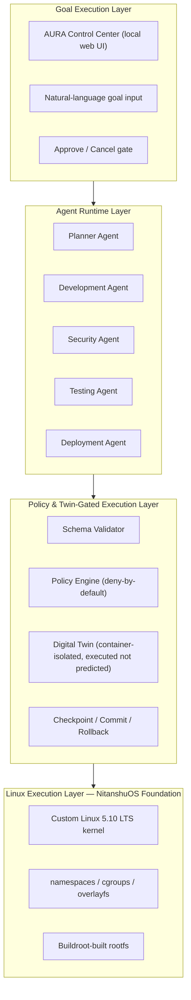
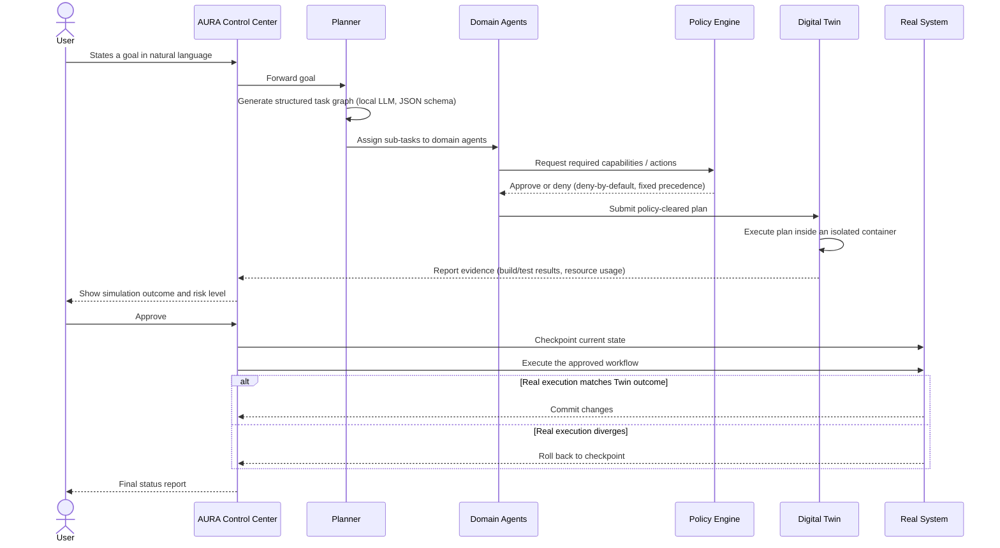
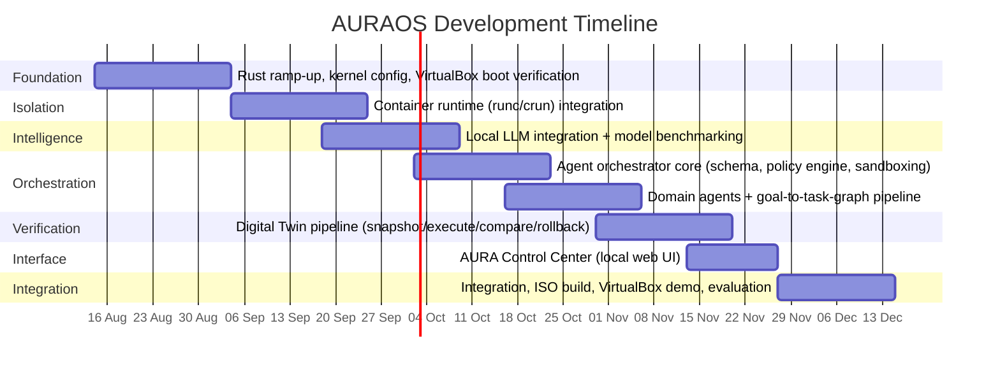

# AURAOS — Project Synopsis

**Agentic Unified Replica Architecture Operating System**
*A Goal-Oriented Operating System with Sandboxed Multi-Agent Execution and Digital-Twin-Gated Verification*

| | |
|---|---|
| **Author** | Nitanshu Tak |
| **SAP ID** | 500121943 |
| **Program** | B.Tech CSE (Cloud Computing and Virtualization Technology) — Semester 7 |
| **Institution** | UPES, School of Computer Science |
| **Mentor** | Dr. Nadeem Khanday |
| **Team** | Solo |
| **Document status** | Living document — updated as the project progresses |

---

## Table of Contents

1. [Abstract](#1-abstract)
2. [Introduction](#2-introduction)
   - [2.1 Background and Motivation](#21-background-and-motivation)
   - [2.2 Problem Statement](#22-problem-statement)
   - [2.3 Technical Concepts and Mechanisms Used](#23-technical-concepts-and-mechanisms-used)
   - [2.4 Area of Application](#24-area-of-application)
   - [2.5 Input Format and Evaluation Data](#25-input-format-and-evaluation-data)
3. [Literature Review](#3-literature-review)
   - [3.1 Related Work](#31-related-work)
   - [3.2 SWOT Analysis](#32-swot-analysis)
4. [Objectives](#4-objectives)
5. [Methodology](#5-methodology)
   - [5.1 Reference Software Development Model](#51-reference-software-development-model)
   - [5.2 System Architecture](#52-system-architecture)
   - [5.3 Development Steps](#53-development-steps)
   - [5.4 Evaluation Metrics](#54-evaluation-metrics)
   - [5.5 Timeline](#55-timeline)
   - [5.6 Scope Boundaries — v1 vs. Future Work](#56-scope-boundaries--v1-vs-future-work)
6. [Expected Outcomes and Deliverables](#6-expected-outcomes-and-deliverables)
7. [Design Principles](#7-design-principles)
8. [References](#references)

---

## 1. Abstract

Modern operating systems manage hardware and run applications, but they do not manage user objectives. Accomplishing any non-trivial goal on a computer today — setting up a development environment, preparing a research workspace, building and deploying an application — still requires the user to act as their own systems integrator: locating tools, resolving dependency conflicts, sequencing steps correctly, and recovering manually when something breaks.

AURAOS (Agentic Unified Replica Architecture Operating System) is a goal-oriented operating system prototype that addresses this gap. Built on **NitanshuOS** — a custom Buildroot-based Linux distribution developed as prior work — AURAOS introduces three additions on top of the existing kernel and userland:

1. A native, sandboxed multi-agent runtime that decomposes a natural-language goal into a structured, schema-validated task graph.
2. A scoped Digital Twin that **actually executes** the proposed workflow inside an isolated container environment before it is allowed anywhere near the real system.
3. A policy-driven authorization layer that gates every privileged action and supports transactional rollback if reality diverges from the simulated outcome.

The project is deliberately scoped for a solo, single-semester build: a local, quantized language model (no external API dependency), three to five clearly defined workflow categories rather than open-ended goal support, and Linux-native isolation primitives (namespaces, cgroups, overlay filesystems, and a standard container runtime) rather than a custom-built isolation layer. The research contribution is not "an operating system with AI in it," but a specific mechanism — **Twin-gated execution** — evaluated experimentally for planning accuracy, simulation-to-reality agreement, safety (false-safe rate), overhead, and rollback reliability.

---

## 2. Introduction

### 2.1 Background and Motivation

Operating systems such as Linux, Windows, and macOS remain fundamentally application-centric: they schedule processes, manage memory, and provide device access, but the responsibility for orchestrating a multi-step objective is left entirely to the user. Consider a simple goal such as "build and deploy a web application." A user must, unaided, install the correct runtime, resolve dependency versions, configure a build pipeline, containerize the application, and deploy it — with no safety net between any individual step and the live state of their machine.

Contemporary AI coding and automation assistants (IDE copilots, CLI agents, workflow bots) have started to close part of this gap, but they operate as applications layered on top of an unaware operating system. They can propose or even execute shell commands, but the OS itself has no concept of a "goal," no mechanism to verify a multi-step plan before it touches the live filesystem, and no native, capability-scoped boundary around what an autonomous agent is allowed to do.

AURAOS explores the alternative: an operating system in which the user states an objective, a runtime of capability-restricted agents plans and verifies the required workflow inside an isolated replica of the environment, and only a checked, explainable, reversible plan is ever applied to the real system.

### 2.2 Problem Statement

> To design and implement AURAOS, a goal-oriented operating system layer built on the NitanshuOS Linux foundation, that accepts a high-level natural-language objective from the user, decomposes it into a schema-validated, capability-constrained task graph using a local language model, executes that task graph inside an isolated, container-based Digital Twin for verification, and commits the resulting changes to the real system only after automated policy checks and explicit user approval — with transactional checkpoint-and-rollback if the real execution diverges from the simulated outcome.

### 2.3 Technical Concepts and Mechanisms Used

- **Goal-to-task-graph planning** — a locally hosted, quantized language model (`llama.cpp` / GGUF) constrained to emit a predefined JSON task-graph schema, rejected and regenerated on malformed output.
- **Deterministic schema and capability validation** — every agent-proposed action is checked against an allowed-action schema and a required-capability list before it is scheduled.
- **Policy-based conflict resolution** — a fixed precedence order (`Security > Stability > User Goal > Performance > Convenience`) deterministically resolves conflicting agent requests, in place of an unproven "negotiation" mechanism.
- **OS-level sandboxing** — Linux namespaces, cgroups, and capabilities restrict each agent process to the minimum access its role requires.
- **Container-based Digital Twin** — a disposable, isolated execution replica (namespaces + overlay filesystem + a standard container runtime) in which the proposed workflow is actually run, not merely predicted.
- **Transactional execution** — filesystem checkpoint before real execution, commit on success, rollback on failure.
- **Simulation-to-reality evaluation** — outcome agreement, resource-estimation error, and false-safe rate measured across repeated workflow runs.

### 2.4 Area of Application

- Automated, verified setup of software development environments.
- Research-project workspace preparation (dependency setup, environment scaffolding).
- Containerization and pre-deployment validation of applications before they reach production infrastructure.
- Safe experimentation platforms for learners, where destructive mistakes are caught before they happen.
- A demonstration platform for the underlying Twin-gated execution and policy-authorization research.

### 2.5 Input Format and Evaluation Data

AURAOS is a systems project rather than a supervised-learning project, so there is no fixed external dataset. The system's inputs and evaluation material are:

- **Primary input:** free-form natural-language goal statements entered through the AURA Control Center.
- **Intermediate representation:** a structured JSON task-graph (goal, ordered sub-tasks, dependencies, required capabilities).
- **Evaluation corpus:** a self-constructed set of representative goals across the supported workflow categories (see [Objectives](#4-objectives)), run repeatedly through the Digital Twin and the real system to compute the metrics defined in [§5.4](#54-evaluation-metrics).

---

## 3. Literature Review

### 3.1 Related Work

**Digital twin verification.** Runtime and formal verification of digital twins has been studied outside the operating-systems context, notably for robotics and cyber-physical systems, where a digital twin continuously mirrors a physical system for monitoring and validation. Betzer et al. propose a digital-twin-based runtime verification approach for autonomous mobile robots that synthesizes safety and performance monitors from an executable twin [1]. Huang, Varshney, and Willcox address the harder problem of formally verifying that a digital twin itself behaves correctly, using temporal logic specifications [2]. A 2026 agile verification-and-validation framework further argues that digital twins for complex, cross-disciplinary systems need combined white-box and black-box testing rather than a single verification technique [3]. AURAOS differs from this body of work in domain and intent: rather than mirroring a continuously running physical system, it creates a disposable, scoped replica of an execution environment purely to gate a one-time workflow before commit.

**Container-based isolation.** The isolation mechanism underlying the AURAOS Digital Twin builds directly on established OS-level virtualization research. Soltesz et al. describe container-based operating-system virtualization as a lightweight, high-performance alternative to hypervisor-based virtualization, which underlies modern container runtimes [4]. More recent work formally characterizes Linux namespaces and cgroups as the specific kernel primitives that provide this isolation and resource control, and compares their overhead against full virtualization [5]. AURAOS uses these same primitives directly, through a standard container runtime, rather than re-implementing isolation from raw system calls.

**Multi-agent LLM orchestration.** Recent surveys document a rapidly growing ecosystem of frameworks (such as LangGraph, CrewAI, and AutoGen) for coordinating multiple LLM-based agents around shared goals, typically organized as centralized, decentralized, or hierarchical planner-executor topologies [6][7]. A 2024 survey on LLM-based multi-agent systems for software engineering frames such systems as an orchestration platform coupled to role-specialized agents — architecturally close to the Planner-plus-domain-agents structure AURAOS adopts [6]. The key distinction is placement: existing frameworks orchestrate agents as an application running above a conventional operating system, whereas AURAOS embeds the orchestrator, the policy engine, and the isolation boundary as native components of the OS itself, with the twin-gate sitting between agent output and any real system call.

**Positioning.** Taken together, the literature offers mature building blocks for each individual layer of AURAOS — digital twin verification, container isolation, multi-agent orchestration — but does not, to the knowledge gathered for this synopsis, combine them into a single OS-native mechanism in which agent-generated plans are unconditionally required to pass an isolated, executed (not merely predicted) replica before touching the real system. This combination is the intended contribution of the project and will be validated against prior art more thoroughly during the literature survey phase before any patent language is finalized.

### 3.2 SWOT Analysis

| | Strengths | Weaknesses |
|---|---|---|
| | Builds on an already-implemented, working NitanshuOS kernel/userland foundation, reducing ground-up risk. Entirely local-first: no paid API, no cloud dependency, reproducible offline. Uses proven Linux isolation primitives (namespaces, cgroups, container runtimes) instead of custom, higher-risk isolation code. | Solo development timeline against a fixed academic deadline. Quantized local LLM plan quality is less reliable than large hosted models, especially for novel goals. The Digital Twin's fidelity is limited to the scoped workflow's side effects, not full OS state — it cannot simulate every class of side effect (e.g. billed cloud actions). |
| | **Opportunities** | **Threats** |
| | Twin-gated execution as a specific, evaluable mechanism is a credible research and (subject to prior-art search) potential patent angle. Growing academic and industry interest in agentic and autonomous systems gives the topic strong relevance. Architecture is modular enough to extend with additional workflow categories after v1. | Adjacent commercial and academic work on agentic developer tooling is moving quickly and may reduce novelty by submission time. Scope creep is a real risk given the breadth of the original concept relative to a solo, one-semester timeline. LLM hallucination or malformed plans reaching execution if schema/policy validation has gaps. |

---

## 4. Objectives

**Main Objective**

> To design and implement AURAOS: a bootable, Linux-based operating system prototype, built on the NitanshuOS foundation, in which a user-stated goal is converted into a policy-checked, agent-executed workflow that is verified inside an isolated Digital Twin before being committed to the real system, with transactional rollback on failure.

**Specific Objectives**

1. Extend the NitanshuOS kernel configuration and rootfs to support namespaces, cgroups, and overlay filesystems required for container-based isolation, and verify boot and networking specifically under VirtualBox.
2. Integrate a local, quantized language model (`llama.cpp` / GGUF) for structured goal-to-task-graph plan generation, benchmarked for the smallest model size that reliably produces valid plans within the project's RAM budget.
3. Implement a native agent runtime (Rust) with a Planner and three to five domain agents (e.g. Development, Security, Testing, Deployment), each running as a capability-restricted, sandboxed process.
4. Implement a deterministic policy engine that validates every proposed action against a schema and a fixed precedence order, denying high-risk actions by default.
5. Implement a container-based Digital Twin that actually executes a proposed workflow in isolation, collects evidence (build/test results, resource usage), and compares it against the real execution outcome.
6. Implement transactional execution with filesystem checkpointing and rollback.
7. Build a local, browser-based AURA Control Center for goal input, plan review, and approve/cancel actions.
8. Package the system as a bootable ISO that runs end-to-end inside VirtualBox, and evaluate it against the metrics defined in [§5.4](#54-evaluation-metrics).

---

## 5. Methodology

### 5.1 Reference Software Development Model

Given a solo developer, an evolving technical specification, and a fixed academic deadline, this project follows an **Iterative and Incremental** development model rather than a Waterfall or V-Model. Each of the eight phases in [§5.3](#53-development-steps) delivers a testable increment (e.g. "containers spin up and tear down cleanly" before any orchestrator logic is written against them), which allows early phases to be validated in isolation and reduces the risk of discovering a foundational problem late in the timeline.

### 5.2 System Architecture

**Execution flow for a single goal:**

### 5.3 Development Steps

| Step | Description |
|---|---|
| 1 — Foundation | Extend the NitanshuOS kernel config for namespaces/cgroups/overlayfs; confirm clean boot, disk, and networking under VirtualBox (not only QEMU, which was used for the original NitanshuOS validation). |
| 2 — Isolation | Integrate a standard container runtime (`runc`/`crun`) on the BusyBox-based rootfs; manually verify container creation, resource limiting via cgroups, and teardown. |
| 3 — Local intelligence | Cross-compile `llama.cpp` into the image; benchmark 1–3B-class quantized models for plan-generation accuracy and memory footprint; fix the model and quantization level against the project's RAM budget. |
| 4 — Orchestrator core | Implement the agent message schema, the Planner, the policy engine, and agent process spawning/sandboxing in Rust. |
| 5 — Domain agents | Implement three to five agents (e.g. Development, Security, Testing, Deployment) and the goal-to-task-graph pipeline, restricted to a fixed set of supported workflow categories. |
| 6 — Digital Twin | Implement the snapshot → execute → collect-evidence → compare pipeline and the checkpoint/commit/rollback transaction mechanism. |
| 7 — Control Center | Implement the local web-based UI (goal entry, plan review, twin results, approve/cancel, execution status) wired to the orchestrator over a local HTTP/WebSocket interface. |
| 8 — Integration and evaluation | Assemble the bootable ISO, run the full pipeline end-to-end in VirtualBox, and collect the evaluation metrics across the evaluation corpus. |

### 5.4 Evaluation Metrics

| Area | Metric |
|---|---|
| Planning | Goal → task-graph accuracy (valid, executable plans produced without regeneration) |
| Agents | Task completion rate per domain agent |
| Digital Twin | Simulation-to-reality agreement (outcome, resource usage, timing) |
| Safety | False-safe rate — how often the Twin reports "safe" but real execution fails |
| Performance | Digital Twin execution overhead relative to direct execution |
| Security | Unauthorized/high-risk action rejection rate at the policy engine |
| Recovery | Successful rollback rate after an induced or real execution failure |
| Usability | Manual steps eliminated per supported workflow, versus the equivalent manual procedure |

### 5.5 Timeline

The project runs solo across the current semester, targeting a mid-December submission window. The phases above overlap deliberately — several cannot be strictly sequential for a single developer — with the final two weeks reserved as integration buffer rather than new feature work.

### 5.6 Scope Boundaries — v1 vs. Future Work

To keep the project achievable within a single semester, the following distinction is treated as a hard project constraint rather than an aspiration.

**V1 — Implemented in this project**

- NitanshuOS foundation extended with container-capable kernel configuration.
- Bootable AURAOS ISO running end-to-end in VirtualBox.
- Native Rust agent runtime with 3–5 real domain agents.
- Goal-to-task-graph generation via a local quantized LLM, with deterministic schema validation.
- Fixed-precedence policy engine (no learned or negotiated consensus in v1).
- Container-based Digital Twin that actually executes proposed workflows, with checkpoint/rollback.
- Support for 3–5 explicitly defined workflow categories, not open-ended goals.
- Local, browser-based AURA Control Center.

**Future Work — explicitly out of scope for v1**

- Learned or negotiated multi-agent consensus protocols (v1 uses a fixed policy precedence).
- Predictive (non-executed) Digital Twin modeling.
- Kernel-level (as opposed to userspace/sandboxed) agent integration.
- Cross-machine or distributed agent coordination.
- Formal verification of the twin-gate mechanism.
- Support for goals outside the fixed workflow categories.

---

## 6. Expected Outcomes and Deliverables

- A bootable AURAOS ISO image, built on the NitanshuOS foundation, runnable end-to-end inside VirtualBox.
- A working agent runtime with 3–5 domain agents executing real, non-mocked actions for their assigned roles.
- A container-based Digital Twin pipeline demonstrating actual (not predicted) workflow execution, evidence collection, and simulation-to-reality comparison.
- A policy engine enforcing deny-by-default authorization on high-risk actions.
- A local web-based AURA Control Center demonstrating the full goal → plan → twin → approval → execution → rollback-or-commit flow.
- An experimental evaluation of the system against the metrics in [§5.4](#54-evaluation-metrics), over the self-constructed evaluation corpus.
- This synopsis and the accompanying repository documentation, kept current with an honest v1-vs-future-work distinction throughout.

---

## 7. Design Principles

These principles are treated as binding constraints on every implementation decision, not aspirational statements:

1. **The LLM proposes, the OS decides.** A language model never receives direct execution authority. Every plan it emits is schema-validated, capability-checked, and policy-gated before it can be scheduled — and even then, it runs in the Digital Twin before it can touch the real system.
2. **Local-first, zero-API-cost.** No paid external AI API, no mandatory cloud dependency. AURAOS must boot, plan, simulate, and execute workflows entirely offline.
3. **Deny by default.** High-risk actions (filesystem access outside the workspace, network access, privilege escalation, destructive operations) are denied unless explicitly authorized by policy.
4. **Execute, don't predict.** The Digital Twin verifies a workflow by actually running it in isolation, not by modeling or guessing its outcome — this project makes no formal-verification claims it cannot back with executed evidence.
5. **Everything reversible.** Any change applied to the real system is preceded by a checkpoint and can be rolled back if execution diverges from the verified simulation.
6. **Honesty about scope.** The distinction between what is implemented and what is future work ([§5.6](#56-scope-boundaries--v1-vs-future-work)) is maintained throughout the project's documentation and is not allowed to blur as development proceeds.

---

## References

[1] J. S. Betzer, J. Boudjadar, M. Frasheri, and P. Talasila, "Digital Twin Enabled Runtime Verification for Autonomous Mobile Robots under Uncertainty," Aarhus University, arXiv:2412.09913, 2024.

[2] L. Huang, L. R. Varshney, and K. E. Willcox, "Formal Verification of Digital Twins with TLA and Information Leakage Control," arXiv:2411.18798, 2024.

[3] M. Zahediyami, V. Delos, S. Gorecki, and M. K. Traoré, "Agile framework for Digital Twin verification and validation: Addressing complexity challenges in cross-disciplinary hybrid systems," University of Bordeaux / IMS Laboratory, 2026.

[4] S. Soltesz, H. Pötzl, M. E. Fiuczynski, A. Bavier, and L. Peterson, "Container-based operating system virtualization: A scalable, high-performance alternative to hypervisors," *ACM SIGOPS Operating Systems Review*, vol. 41, no. 3, pp. 275–287, 2007.

[5] "Linux Namespaces and cgroups as OS Primitives for Lightweight Virtualization: Architecture, Isolation Mechanisms, and Performance Evaluation," *Turkish Journal of Computer and Mathematics Education* (TURCOMAT), 2026.

[6] "A survey on LLM-based multi-agent systems: workflow, infrastructure, and challenges," Vicinagearth, Springer Nature, 2024.

[7] "LLM-Based Multi-Agent Orchestration: A Survey of Frameworks, Communication Protocols, and Emerging Patterns," MDPI, 2026.

[8] NitanshuOS project repository (prior work by the author) — [github.com/Nitanshu715/NitanshuOS](https://github.com/Nitanshu715/NitanshuOS).

> **Note:** this reference list reflects the sources consulted for this synopsis. A more exhaustive prior-art and literature search (targeting venues such as SOSP, OSDI, EuroSys, and USENIX ATC) is planned as an early project phase, per [§3.1](#31-related-work), before any patent or publication language is finalized.
