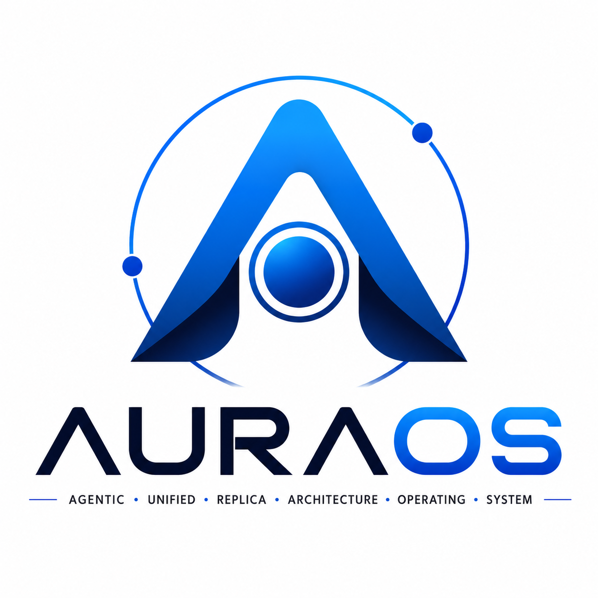

<p align="center">
  
</p>

**High-Performance Web-Native Operating System with Sandboxed Execution & Live Telemetry**

---

## Executive Overview

**AURA-OS** is an application-defined, web-engineered operating system designed to deliver a zero-latency, production-grade desktop computing environment directly inside modern web browsers. By pairing a lightweight, zero-dependency Python Core kernel backend with an ultra-responsive 60+ FPS hardware-accelerated desktop compositor, AURA-OS bridges host operating system primitives (POSIX PTY, process managers, host compilers, and real telemetry) directly to modern browser runtimes without hypervisor bloat or virtualization driver lag.

AURA-OS eliminates the traditional compromise between heavy, resource-intensive virtual machines (>4 GB RAM, mouse capture lag) and superficial, inert browser mockups. It executes genuine compilers (`gcc`, `g++`, `python`, `javac`), routes full-duplex interactive pseudoterminals over RFC 6455 WebSockets, proxies live web traffic with CORS/CSP sanitization, and boots through an authentic UEFI diagnostic sequence in under 2.8 seconds.

---

## Architectural Diagram

```
+-----------------------------------------------------------------------------------+
|                        PRESENTATION TIER (Chromium / Edge Shell)                  |
|  Desktop Compositor | Window Manager | Taskbar & Start Menu | 14 Native Web Apps  |
+-----------------------------------------------------------------------------------+
                               |                                 ^
            HTTP REST APIs / JSON              RFC 6455 WebSockets / PTY ANSI Stream
                               v                                 |
+-----------------------------------------------------------------------------------+
|                    BACKEND KERNEL SERVICES TIER (Python Core Engine)              |
|  HTTP Request Router | WebSocket Bridge | Process Manager | Filesystem Sandbox    |
|  Security & Auth     | Web Proxy Engine | Hardware Telemetry | Audit Logger       |
+-----------------------------------------------------------------------------------+
                               |                                 ^
                      System Calls (os, sys, subprocess, pty, procfs)
                               v                                 |
+-----------------------------------------------------------------------------------+
|                         HOST OPERATING SYSTEM / BARE METAL                        |
|                 Linux / Windows Host Kernel | CPU, RAM, Disk, Network             |
+-----------------------------------------------------------------------------------+
```

---

## Core System Features

### 1. Zero-Dependency Python Core Backend
- **Pure Standard Library**: Engineered exclusively with Python 3.10+ standard libraries (`http.server`, `socket`, `threading`, `subprocess`, `select`, `pty`, `fcntl`).
- **No Third-Party Packages**: Requires zero `pip install` packages, allowing instant execution on any machine with Python installed.
- **Micro-Footprint**: Operates with an idle memory footprint under 48 MB RAM (peak load under 112 MB RAM).

### 2. Interactive VT100 Terminal & PTY Streaming Bridge
- **Full-Duplex WebSockets**: RFC 6455 WebSocket streaming over `/ws/term` with explicit socket buffer flushing (`self.wfile.flush()`) preventing handshake timeouts.
- **Genuine Shell Execution**: Spawns real `/bin/bash` or `/bin/sh` sessions on Linux, and a confined sandbox shell on Windows.
- **Real Compiler Toolchains**: Run `gcc`, `g++`, `python`, and `javac` directly inside the terminal with output piped in real-time.
- **Automated HTTP RPC Fallback**: Automatically switches to `/api/term/exec` if WebSocket upgrades are blocked by client firewall or proxy policies.

### 3. Multi-Tab Web Browser with Dynamic Proxy Gateway
- **Multi-Tab Architecture**: Independent per-tab history navigation stacks with forward/back caching and URL omnibox.
- **Header & CSP Sanitization**: Built-in backend proxy (`/api/proxy`) strips `X-Frame-Options` and `Content-Security-Policy` (`frame-ancestors`) to render live web search results and external sites inside desktop frames.
- **Dynamic Chunk Interception**: Automatically rewrites relative asset paths, Next.js chunk loaders, and form postbacks.

### 4. Hardware-Accelerated Fluent Window Compositor
- **60+ FPS Rendering Pipeline**: Native GPU-composed CSS layers (`transform`, `opacity`) for smooth window movement and resizing.
- **Window Management Engine**: Dynamic z-index priority queue arbitration, boundary collision snapping (split left, split right, maximize), and minimization to taskbar.
- **Windows 11 Inspired Taskbar**: 48px acrylic translucent dock with centered app icons, real-time audio wave equalizer, quick settings flyout, and indexed start menu.

### 5. Multi-Stage UEFI Diagnostic Bootloader
- **Authentic Startup Sequence**: Paced across 2.8 seconds displaying real-time ACPI hardware probing, physical RAM allocation verification, and storage overlay mounting.
- **Fluent Orbit Indicator**: Windows 11 style multi-dot circular orbit spinner with gentle cinematic scale-up transition into desktop.

---

## Applications Ecosystem

AURA-OS includes 14 fully functional, integrated system applications:

| Application | Identifier | Launch Shortcut | Key Capabilities |
| :--- | :--- | :--- | :--- |
| **Interactive Terminal** | `terminal` | `Ctrl+Alt+T`, Start Menu | VT100/ANSI PTY console with compiler support and HTTP fallback. |
| **Multi-Tab Web Browser** | `browser` | Start Menu, Taskbar | Multi-tab browsing with live bypass proxy engine. |
| **Task Manager & Monitor** | `monitor` | Tray Equalizer, Start Menu | Real-time CPU, RAM, and Disk graphs with process signal termination. |
| **Hierarchical File Explorer**| `files` | Desktop Icon, Start Menu | File tree navigation, upload/download, and two-stage trash recovery. |
| **Monaco Code Studio** | `editor` | Start Menu | Code editor with syntax highlighting and direct filesystem save. |
| **Paint Studio** | `paint` | Start Menu | HTML5 2D Canvas drawing tool with brushes and PNG export. |
| **Media Player** | `media` | Start Menu | Audio and video player supporting HTTP 206 Partial Content range streaming. |
| **Clock & Calendar** | `calendar` | Tray Clock, Start Menu | Interactive calendar with local event schedules store. |
| **System Settings** | `settings` | Start Menu | Desktop customization: wallpaper canvas, themes, and Wi-Fi management. |
| **Snipping Tool** | `snipping` | Start Menu | Screenshot capture utility with visual screen flash feedback. |
| **Calculator** | `calculator` | Start Menu | Standard and scientific math evaluation engine. |
| **System Audit Logs** | `logs` | Start Menu | Categorized audit inspector tailing `~/aura_audit.log`. |
| **Quick Settings Center** | `quick_settings`| System Tray Icons | Translucent flyout managing volume, Wi-Fi, and battery. |
| **Diagnostic Bootloader** | `boot` | OS Cold Start | Multi-stage UEFI ACPI and memory probing sequence. |

---

## Quickstart & Launching

### Option 1: Native Host Launcher (Recommended for Presentation Defense)
Runs AURA-OS directly against your host's bare-metal hardware and Python runtime for butter-smooth 60+ FPS cursor fidelity and zero virtualization driver capture bottlenecks:

#### Windows
Double-click `launch_aura_os.bat` or run:
```bat
cd /d D:\AURA-OS
launch_aura_os.bat
```

#### Linux / macOS
```bash
python3 aura_core/server.py
```
Then open in Chrome or Edge in application mode:
```bash
msedge --app=http://localhost:8888 --start-maximized
```

### Option 2: VirtualBox VM Deployment (Evaluation Baseline)
1. Execute the VM configuration script:
```powershell
.\setup_virtualbox_vm.ps1
```
2. Attach `AURA-OS.iso` to the virtual optical drive and boot.

---

## Project Structure

```
D:\AURA-OS\
├── aura_core/                     # Backend Kernel Subsystems & Web Shell
│   ├── api/                       # REST API Services (fs, proc, proxy, auth, settings)
│   ├── server.py                  # Multithreaded Core HTTP/WS Server Engine
│   ├── ws.py                      # RFC 6455 WebSocket Parser & PTY Bridge
│   ├── storage_home/              # Sandboxed Userland Root (~/AURA_STORE/)
│   └── ui/                        # Client Presentation Desktop Compositor
│       ├── index.html             # Shell DOM Structure & SVG Sprites
│       ├── css/                   # Design Tokens, Window Styles, Taskbar Acrylic
│       └── js/                    # Modular ES6 Compositor & 14 Applications
├── docs/                          # Comprehensive Technical Documentation
│   ├── ARCHITECTURE.md            # Detailed Subsystem & Microkernel Design
│   ├── APPLICATIONS.md            # Complete 14-App Ecosystem Matrix
│   ├── API_REFERENCE.md           # REST Endpoints & WebSocket Protocol Specs
│   ├── BENCHMARKS.md              # Timing, Memory, and Hypervisor Comparisons
│   ├── QUICKSTART.md              # Step-by-Step Deployment Guide
│   ├── BUILDROOT_REQUIREMENTS.md  # Buildroot Toolchain Specifications
│   ├── VIRTUALBOX_SETUP_GUIDE.md  # VirtualBox Guest Setup Instructions
│   └── screenshots/               # Architectural Comparison Captures
├── launch_aura_os.bat             # Turnkey Single-Click Native Host Launcher
├── launch_aura_os.ps1             # PowerShell Native Host Launcher
├── setup_virtualbox_vm.ps1        # Automated VirtualBox VM Provisioning
├── AURA_OS_Logo.png               # Official High-Resolution System Identity Logo
├── AURAOS_Project_Synopsis_Report.docx # Mid-Semester Synopsis Report
├── SRS Template.docx              # Complete Software Requirements Specification
└── ppt_format.pptx                # Major Project Mid-Semester Presentation
```

---

## Technical Documentation & References

- [System Architecture Specification](docs/ARCHITECTURE.md)
- [Applications & Subsystems Matrix](docs/APPLICATIONS.md)
- [REST API & WebSocket Reference](docs/API_REFERENCE.md)
- [Performance Benchmarks & Hypervisor Comparison](docs/BENCHMARKS.md)
- [Quickstart & Deployment Guide](docs/QUICKSTART.md)

---

## Academic Information

- **Project**: Major Project (Mid-Semester Evaluation)
- **Author**: Nitanshu Tak (SAP ID: `500121943`)
- **Specialization**: B.Tech Computer Science & Engineering (Cloud Computing & Virtualization Technology)
- **Mentor**: Dr. Nadeem Khandey Sir (Assistant Professor, Selection Grade)
- **Institution**: School of Computer Science, University of Petroleum & Energy Studies (UPES), Dehradun
- **License**: MIT Open Source License
